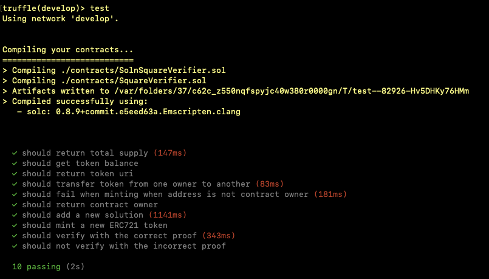
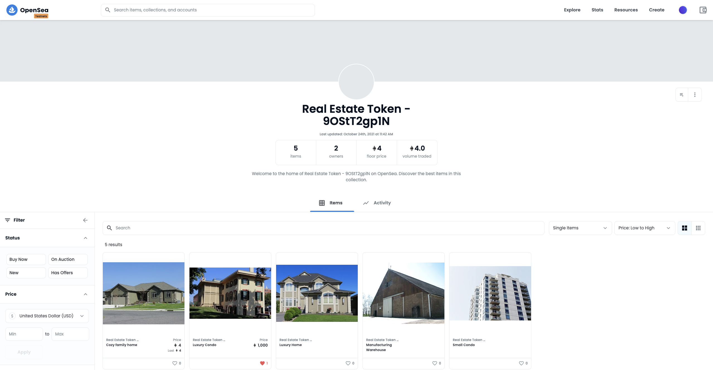

# Real Estate Marketplace

This is a ERC721 (NFT) for real estate marketplace. Each NFT is backed by
Zero-Knowledge Succinct Non-Interactive Argument of Knowledge (zk-SNARK). That
means when a new house title is created, a proof is generated, and a token with
the proof is submiited to the blockchain. House owner with the proof can verify 
its title's authenticity on the blockchain. Also NFT facilicates easy transfer
and sale, replaces the real estate escrow service, saves people money and time.


## Core

* `ERC721Mintable.sol` implements ERC721 (NFT)
* `SquareVerifier.sol` implements the zk-SNARK
* `SolnSquareVerifier.sol` inherit both contracts above, and becomes the NFT with zk-SNARK

## Tests

Run

```
truffle develop
test
```



## NFT Links

* [Contract address](https://rinkeby.etherscan.io/address/0xc4F9807AC3B432EE79888962d353488B8a2cEB72)
* [Contract Abi's](eth-contracts/build/contracts/SolnSquareVerifier.json)
* [OpenSea MarketPlace Storefront](https://testnets.opensea.io/collection/real-estate-token-9ostt2gp1n)



## Project Resources

- [Remix - Solidity IDE](https://remix.ethereum.org/)
- [Visual Studio Code](https://code.visualstudio.com/)
- [Truffle Framework](https://truffleframework.com/)
- [Open Zeppelin ](https://openzeppelin.org/)
- [Interactive zero knowledge 3-colorability demonstration](http://web.mit.edu/~ezyang/Public/graph/svg.html)
- [Docker](https://docs.docker.com/install/)
- [ZoKrates](https://github.com/Zokrates/ZoKrates)
